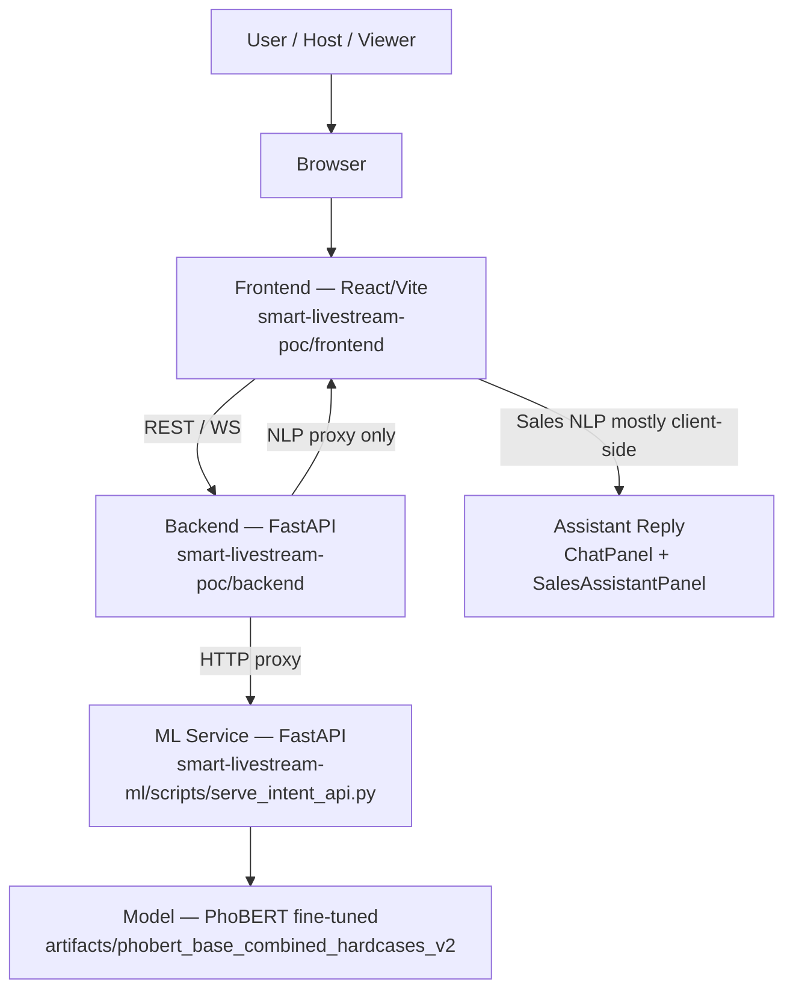
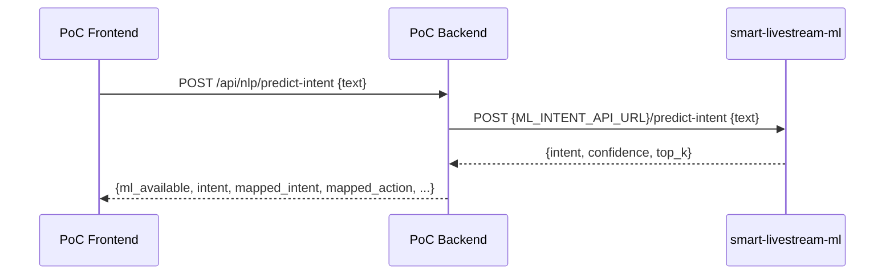
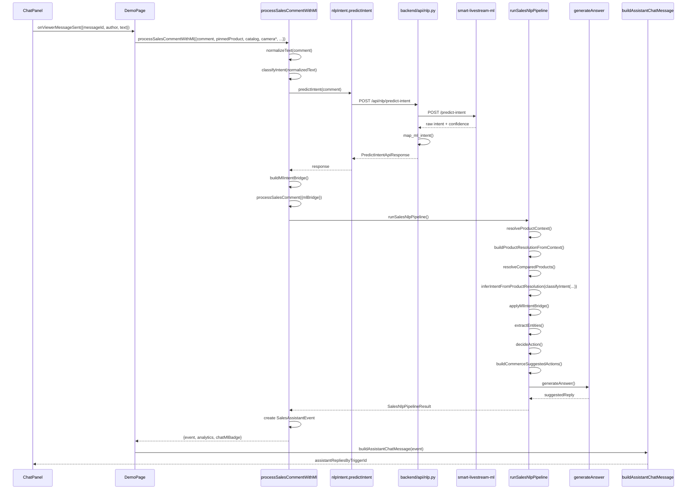
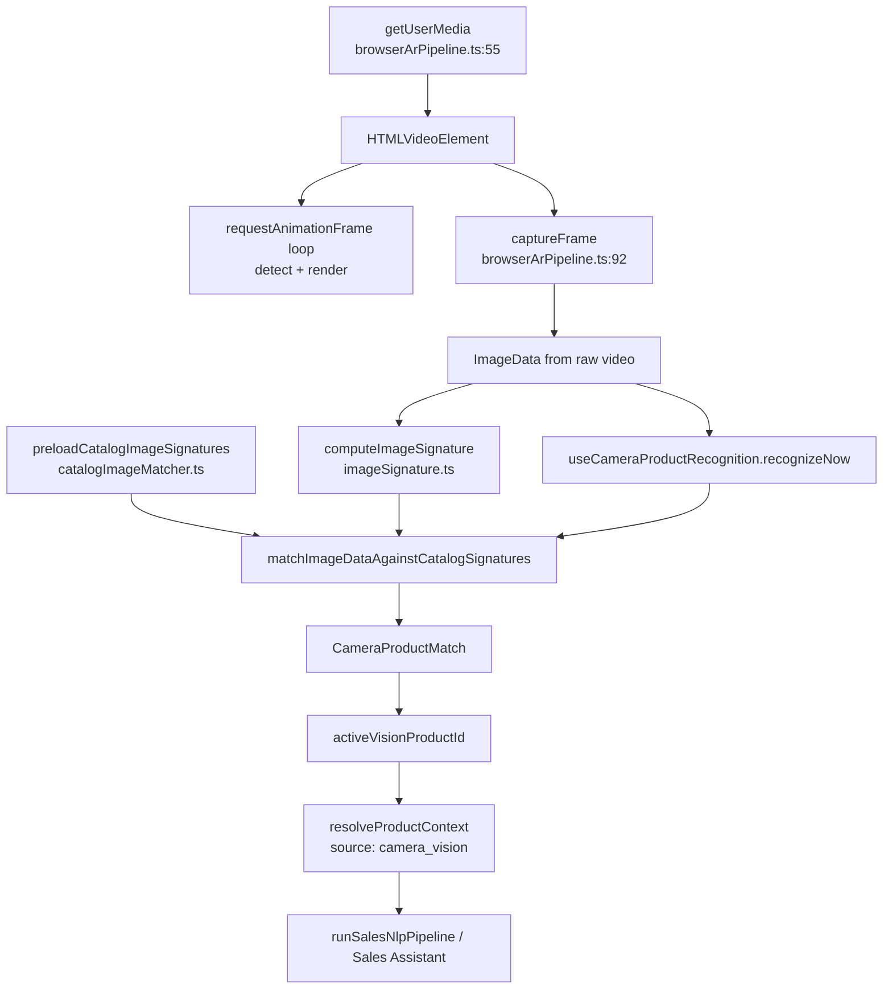
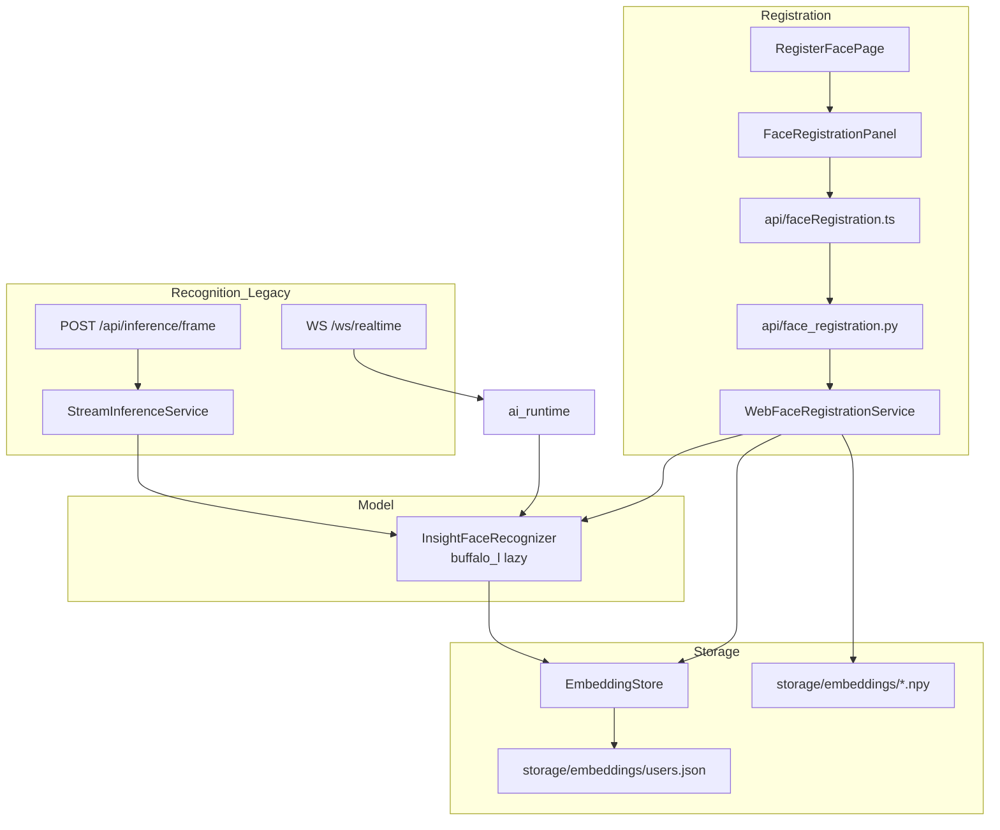

# Smart Livestream AI — Canonical System Architecture

> **V1 runtime note (2026-07):** Legacy backend face registration, inference, MJPEG video-feed, realtime WebSocket, interaction-events, and product-vision APIs were removed from the running app. Sections below may still describe that historical stack for thesis context. **Active backend routes:** `/api/health`, `/api/nlp/*`, `/ws/chat`. **Active frontend:** single `DemoPage` only.

**Scope:** Two-repository ecosystem · read-only reverse engineering · no code changes  
**Repositories:**
- **Repository A:** `smart-livestream-poc` — running application
- **Repository B:** `smart-livestream-ml` — Vietnamese intent classification model + inference API

**Legend:** **FACT** = verified in source code or committed docs. **ASSUMPTION** = inferred from docs or deployment patterns, not runtime-verified in this session.

---

## PART 1 — Overall System Architecture



### Layer responsibilities

| Layer | Location | Responsibility |
|-------|----------|----------------|
| **User** | Browser | Host runs livestream demo; viewers send chat messages |
| **Browser** | Client device | Webcam (`getUserMedia`), MediaPipe WASM, canvas rendering, local NLP orchestration |
| **Frontend** | `frontend/src/` | UI, Browser AR, Sales NLP pipeline, product context, camera recognition (client), commerce mock, chat client |
| **Backend** | `backend/app/` | REST/WS APIs: health, NLP proxy to ML, chat relay |
| **ML Service** | `smart-livestream-ml` | Loads PhoBERT once at startup; serves `/predict-intent` |
| **Model** | `artifacts/phobert_base_combined_hardcases_v2/` (default serve path) | 11-class Vietnamese intent classifier |
| **Assistant Reply** | `answerGenerator.ts` → `buildAssistantChatMessage()` → `ChatPanel` | Template-based Vietnamese replies + host recommendations |

**FACT:** Full sales reasoning (product context, intent rules, answer generation) runs in the **frontend**. The backend does **not** run `ProductContextResolver` over HTTP — it exists as a Python library for tests only (`backend/app/services/product_context_resolver.py`).

**FACT:** ML is **optional**. When unavailable, `buildMlIntentBridge()` falls back to regex (`frontend/src/features/sales-nlp/mlIntentBridge.ts`).

---

## PART 2 — Business Workflow

Complete livestream story from seller go-live to checkout:

### Step 1 — Seller starts livestream

**FACT:** Host clicks **Start Stream** on `DemoPage` → `setIsStreamLive(true)` (`frontend/src/pages/DemoPage.tsx:306–308`).

### Step 2 — Camera

**FACT:** `BrowserArStream` detects `isLive` → `BrowserArPipeline.start()` calls `navigator.mediaDevices.getUserMedia()` (`browserArPipeline.ts:55–64`).

### Step 3 — AR

**FACT:** If effect ≠ `"none"` or debug overlay on, `FaceLandmarkerEngine.init()` loads MediaPipe FaceLandmarker from CDN (`faceLandmarkerEngine.ts:12–24`, `browserArPipeline.ts:66–69`). Effects drawn via `renderBrowserArEffect()`.

**FACT:** Browser AR does **not** run InsightFace identity recognition (no matches in `features/browser-ar/`).

### Step 4 — Viewer comments

**FACT:** `ChatPanel` opens WebSocket to `/ws/chat/demo`, broadcasts messages. When viewer name matches sent message, `onViewerMessageSent` fires (`ChatPanel.tsx` → `DemoPage.handleViewerMessageSent`).

### Step 5 — Intent prediction

**FACT:** `processSalesCommentWithMl()` calls `predictIntent()` → `POST /api/nlp/predict-intent` → backend proxies to ML service → `buildMlIntentBridge()` merges ML with regex (`processSalesComment.ts:160–168`, `mlIntentBridge.ts:180–222`).

### Step 6 — Product context resolution

**FACT:** `runSalesNlpPipeline()` calls `resolveProductContext()` with pinned product, manual camera ID, and vision detection (`salesNlpPipeline.ts:203–211`, `productContextResolver.ts:129–187`).

Priority chain:

1. Explicit catalog match
2. Camera vision (≥ 0.55)
3. Manual camera context
4. Pinned product
5. Fuzzy catalog candidate
6. Clarification

### Step 7 — Sales reasoning

**FACT:** Pipeline continues: `classifyIntent()` → `inferIntentFromProductResolution()` → `applyMlIntentBridge()` → `extractEntities()` → `decideAction()` → `generateAnswer()` (`salesNlpPipeline.ts:221–274`).

### Step 8 — Assistant reply

**FACT:** If action is `AUTO_REPLY_SUGGESTED` or `ESCALATE_TO_HOST`, `buildAssistantChatMessage()` creates reply merged into chat (`DemoPage.tsx:179–194`, `assistantChatMessages.ts:5–18`).

### Step 9 — Recommendation

**FACT:** `SalesAssistantPanel` calls `generateSalesRecommendations(analytics)` — rule-based host tips (hot leads, price questions, etc.) (`salesRecommendations.ts:3–50`, `SalesAssistantPanel.tsx:23`).

### Step 10 — Checkout

**FACT:** `buildCommerceSuggestedActions()` attaches commerce buttons to events (`commerceIntentActions.ts`). Host clicks → `cart.applySuggestedAction()` → `useCommerceCart` updates local cart → `CheckoutModal` → `checkoutService.createMockOrder()` — **no backend persistence** (`useCommerceCart.ts`, `checkoutService.ts`).

### Parallel: Camera product recognition (when flag on)

**FACT:** While live, `useCameraProductRecognition` polls every 3s, feeds `detectedCameraProductId` into NLP (`useCameraProductRecognition.ts:112–122`, `DemoPage.tsx:156–157`).

---

## PART 3 — Repository Relationship

### Repository A — `smart-livestream-poc`

| Domain | Key paths |
|--------|-----------|
| Frontend app | `frontend/src/` |
| Backend API | `backend/app/` |
| Face recognition | `face_recognition/`, `face_registration/` |
| Gesture (legacy) | `gesture_detection/` |
| Embeddings storage | `storage/embeddings/` |
| Deployment | `deploy/railway.*.toml`, Dockerfiles |
| Docs | `docs/` |

### Repository B — `smart-livestream-ml`

| Domain | Key paths |
|--------|-----------|
| Datasets | `data/generated/`, `data/processed/` |
| Training | `scripts/train_phobert.py`, `scripts/train_baseline.py` |
| Inference | `scripts/predict_intent.py`, `scripts/serve_intent_api.py` |
| Schemas/taxonomy | `schemas/`, `docs/intent_taxonomy_v1.md` |
| Model artifacts | `artifacts/` (gitignored) |

### How they communicate



**FACT — APIs used between repos:**

| Caller | Endpoint | Callee |
|--------|----------|--------|
| Frontend | `POST /api/nlp/predict-intent` | PoC backend |
| Frontend | `GET /api/nlp/health` | PoC backend |
| PoC backend | `POST {ML_INTENT_API_URL}/predict-intent` | ML service |
| PoC backend | `GET {ML_INTENT_API_URL}/health` | ML service |

**FACT — Env wiring:** `ML_INTENT_API_URL` default `http://127.0.0.1:8010` (`backend/app/services/ml_intent_client.py:11–16`). ML service default port 8010 (`smart-livestream-ml/scripts/serve_intent_api.py:29`).

**FACT:** ML service is **not** a container in PoC `docker-compose.yml`; it runs separately on host or another deploy target.

### Conceptually shared components

| Concept | Repo A | Repo B |
|---------|--------|--------|
| Intent labels (11 ML) | Mapped via `ml_intent_mapper.py` / `mlIntentBridge.ts` | Native taxonomy in `docs/intent_taxonomy_v1.md` |
| Intent → action mapping | `ML_INTENT_MAP` in both mapper files | N/A (raw intent only) |
| Product context | Frontend + backend library (not ML) | N/A |
| Camera recognition | dHash + histogram matcher | N/A |

**ASSUMPTION:** Production Railway deploy typically leaves `ML_INTENT_API_URL` unset (per `.env.railway.example` and `docs/RAILWAY_DEPLOYMENT.md`), so ML is off in cloud unless explicitly configured.

---

## PART 4 — Repository A Deep Inspection

### Module dependency graph

```mermaid
flowchart TB
  subgraph Pages
    DP[DemoPage]
    RFP[RegisterFacePage]
    AL[ArLabPage POC]
    SL[SalesLabPage POC]
  end

  subgraph BrowserAR[browser-ar]
    BAS[BrowserArStream]
    BAP[BrowserArPipeline]
    FLE[FaceLandmarkerEngine]
  end

  subgraph CameraRec[camera-product-recognition]
    UCPR[useCameraProductRecognition]
    CIM[catalogImageMatcher]
    ISG[imageSignature]
  end

  subgraph Catalog[product-catalog]
    PROD[products.ts]
    PCP[ProductCatalogPanel]
  end

  subgraph SalesNLP[sales-nlp]
    SNP[salesNlpPipeline]
    PCR[productContextResolver]
    PMR[productMentionResolver]
    PS[product-search]
    IC[intentClassifier]
    MIB[mlIntentBridge]
    AG[answerGenerator]
  end

  subgraph SalesAsst[sales-assistant]
    PSC[processSalesComment]
    SAP[SalesAssistantPanel]
    PCC[ProductContextControl]
    PPP[PinnedProductPanel]
    SR[salesRecommendations]
  end

  subgraph Commerce[commerce]
    UCC[useCommerceCart]
    CIA[commerceIntentActions]
  end

  subgraph API[frontend/api]
    CHAT[chat.ts]
    NLP[nlpIntent.ts]
    FR[faceRegistration.ts]
  end

  subgraph Backend[backend/app]
    MAIN[main.py]
    NLPAPI[nlp.py]
    CHATWS[chat.py]
    FREG[face_registration.py]
    PV[product_vision.py]
    INF[inference.py legacy]
    VF[video_feed.py legacy]
    RT[realtime.py unused by FE]
  end

  DP --> BAS --> BAP --> FLE
  DP --> UCPR --> CIM --> ISG
  DP --> PROD
  DP --> PSC --> SNP
  SNP --> PCR --> PMR --> PS
  SNP --> IC --> MIB
  SNP --> AG
  SNP --> CIA --> UCC
  PSC --> NLP --> NLPAPI
  DP --> CHAT --> CHATWS
  DP --> SAP --> SR
  DP --> PCC
  DP --> PPP
  DP --> PCP
  RFP --> FR --> FREG
  NLPAPI --> ML_EXT[smart-livestream-ml external]
```



### Module dependency summary

| Module | Depends on | Depended on by |
|--------|------------|----------------|
| **Browser AR** | MediaPipe CDN, canvas, webcam | DemoPage, SalesLab (display only), ArLab |
| **Camera Recognition** | Browser AR `captureFrame`, catalog `imageUrl`, feature flag | DemoPage → ProductContextResolver inputs |
| **Product Catalog** | Static `DEMO_PRODUCTS` | AR effects, NLP, commerce, camera matcher |
| **Product Context** | Catalog, camera/pinned/manual/vision IDs | Sales NLP pipeline |
| **Sales NLP** | Product context, intent rules, optional ML bridge, product-search | processSalesComment |
| **Sales Assistant** | Sales NLP output, analytics | DemoPage UI, chat auto-reply |
| **Commerce** | Catalog products | SalesAssistantPanel action buttons |
| **Face Registration** | InsightFace (lazy), EmbeddingStore | RegisterFacePage only |
| **Chat** | WebSocket backend | DemoPage viewer trigger for NLP |
| **Backend NLP proxy** | ML service HTTP | Frontend `nlpIntent.ts` |
| **Backend product-vision** | OpenCV matcher | **No frontend consumer** (FACT: grep found zero `product-vision` refs in frontend) |
| **Legacy inference/video-feed** | InsightFace, OpenCV, StreamInferenceService | BrowserCameraStream (deprecated), AiEventFeedPanel poll |
| **Realtime WS** | ai_runtime.py | Tests/scripts only — no frontend client |
| **Deployment** | Railway Docker, env flags | All backend/frontend build |

---

## PART 5 — Repository B Deep Inspection

### Dataset

**FACT:** JSONL format, schemas at `schemas/livestream_intent_v1.schema.json` and `v2.schema.json`.

**FACT:** Latest combined dataset: `livestream_intent_combined_hardcases_v2.jsonl` (~5,298 samples) → stratified 70/15/15 split in `data/processed/combined_hardcases_v2/` via `scripts/build_hardcases_v2_pipeline.py`.

**FACT:** Sources include synthetic livestream style, hard cases, BC4RII adapter output, real annotation batches (see `data/generated/` file list in ML repo).

### Intent taxonomy (11 labels)

**FACT:** Documented in `docs/intent_taxonomy_v1.md`:

`ASK_PRICE`, `ASK_STOCK`, `ASK_VARIANT`, `ASK_LINK`, `ASK_SHIPPING`, `ASK_PROMOTION`, `PRODUCT_INFO`, `PURCHASE_INTENT`, `CHITCHAT`, `COMPLAINT`, `SPAM_TOXIC`

### Training pipeline

| Stage | Script | Model |
|-------|--------|-------|
| Baseline | `scripts/train_baseline.py` | TF-IDF + LogisticRegression |
| Primary | `scripts/train_phobert.py` | `vinai/phobert-base` → `RobertaForSequenceClassification` |
| Config | `configs/phobert_base.yaml` | 3 epochs, lr 2e-5, data `combined` |
| Fine-tune v2 | `configs/phobert_base_hardcases_v2.yaml` | 2 epochs, lr 1e-5, continues from `phobert_base_combined_hardcases` + `hard_cases_v2` |
| Fine-tune v3 | `configs/phobert_base_hardcases_v3.yaml` | 2 epochs, lr 1e-5, continues from `phobert_base_combined_hardcases_v2` + capped `hard_cases_v3` |

**FACT:** Best checkpoint selected by **dev macro F1** (`train_phobert.py`).

**FACT:** Hardcases v3 (`phobert_base_combined_hardcases_v3`) improves held-out greeting/chitchat eval but **regressed** manual UI on thanks, rep-help, and short product names — **not used as default** (v2 retained).

**FACT:** Hardcases v2 test metrics in `artifacts/phobert_base_combined_hardcases_v2/metrics.json`: accuracy 0.961, macro F1 0.963.

### Evaluation

**FACT:** `train_phobert.py` → `evaluate_model()` produces `metrics.json`, `classification_report.txt`.

**FACT:** `scripts/analyze_errors.py` → confusion pairs + `error_analysis.csv` for baseline.

### Exported model

**FACT:** HuggingFace `save_pretrained()` layout:

- `config.json`, `model.safetensors` (~540 MB), tokenizer files, `label_mapping.json`
- Default serve dir: `artifacts/phobert_base_combined_hardcases_v2`
- Experimental (not default): `artifacts/phobert_base_combined_hardcases_v3`
- **FACT:** `artifacts/` is gitignored (`.gitignore` in ML repo)

### Inference API

**FACT:** `scripts/serve_intent_api.py`:

- `create_app(model_dir)` loads model at startup via `load_bundle()`
- `GET /health` → `{status, model_dir}`
- `POST /predict-intent` → `{intent, confidence, top_k[]}`

**FACT:** `predict_intent.py` → `predict_text()`:

- Tokenize max_length=96
- Softmax → top-3 intents
- Returns dict consumed by FastAPI response model

### Model loading

**FACT:** Loaded **once at ML server startup** — not lazy (`serve_intent_api.py:54`).

**FACT:** Device: CUDA if available, else CPU (`predict_intent.py:44–46`).

**FACT:** No env vars for ML service configuration — CLI args `--model-dir`, `--host`, `--port` only.

### Predictions returned

**FACT — ML raw response:**

```json
{"intent": "ASK_VARIANT", "confidence": 0.92, "top_k": [...]}
```

**FACT — PoC backend enrichment** (`backend/app/api/nlp.py:54–80`):
Adds `mapped_intent`, `mapped_action`, `suppress_event`, `is_complaint_escalation`, `is_spam_moderation`, `ml_available`.

**FACT — Frontend hybrid decision** (`mlIntentBridge.ts:140–177`):
ML used only if confidence ≥ threshold (default 0.5; PRODUCT_INFO 0.7; CHITCHAT/SPAM 0.45) via `shouldUseMlIntent()`.

---

## PART 6 — End-to-End Data Flow (Viewer Comment)



### Function call list (in order)

| # | Function | File |
|---|----------|------|
| 1 | `handleSendChatMessage` | `components/ChatPanel.tsx` |
| 2 | `createOutgoingChatMessage` | `api/chat.ts` |
| 3 | `onViewerMessageSent` → `handleViewerMessageSent` | `pages/DemoPage.tsx` |
| 4 | `processSalesCommentWithMl` | `features/sales-assistant/processSalesComment.ts` |
| 5 | `normalizeText` | `features/sales-nlp/normalizeText.ts` |
| 6 | `classifyIntent` | `features/sales-nlp/intentClassifier.ts` |
| 7 | `predictIntent` | `api/nlpIntent.ts` |
| 8 | `predict_intent` (backend) | `backend/app/api/nlp.py` |
| 9 | `predict_ml_intent` | `backend/app/services/ml_intent_client.py` |
| 10 | `predict_intent_endpoint` → `predict_text` | ML: `serve_intent_api.py` → `predict_intent.py` |
| 11 | `map_ml_intent` | `backend/app/services/ml_intent_mapper.py` |
| 12 | `buildMlIntentBridge` | `features/sales-nlp/mlIntentBridge.ts` |
| 13 | `processSalesComment` | `processSalesComment.ts` |
| 14 | `runSalesNlpPipeline` | `features/sales-nlp/salesNlpPipeline.ts` |
| 15 | `resolveProductContext` | `features/sales-nlp/productContextResolver.ts` |
| 16 | `findExplicitCatalogMatch` / `findConfidentCatalogCandidate` | `features/sales-nlp/productMentionResolver.ts` |
| 17 | `inferIntentFromProductResolution` | `salesNlpPipeline.ts` |
| 18 | `applyMlIntentBridge` | `salesNlpPipeline.ts` |
| 19 | `extractEntities` | `features/sales-nlp/entityExtractor.ts` |
| 20 | `decideAction` | `features/sales-nlp/actionDecider.ts` |
| 21 | `buildCommerceSuggestedActions` | `features/commerce/commerceIntentActions.ts` |
| 22 | `generateAnswer` | `features/sales-nlp/answerGenerator.ts` |
| 23 | `updateAnalytics` | `processSalesComment.ts` |
| 24 | `shouldAutoReplyInChat` | `processSalesComment.ts` |
| 25 | `buildAssistantChatMessage` | `features/sales-assistant/assistantChatMessages.ts` |
| 26 | `mergeChatWithAssistantReplies` | `assistantChatMessages.ts` (in ChatPanel) |
| 27 | `buildChatMlIntentBadge` | `mlIntentBridge.ts` |

---

## PART 7 — Camera Flow



### Detailed trace

| Step | What happens | Source |
|------|--------------|--------|
| 1 | User clicks Start Stream | `DemoPage.tsx` |
| 2 | `getUserMedia({video: 640×480 ideal})` | `browserArPipeline.ts:55–62` |
| 3 | FaceLandmarker init if effect active | `browserArPipeline.ts:66–69` |
| 4 | AR render loop | `browserArPipeline.ts` `loop()` |
| 5 | Every 3s (if flag on): `captureFrame()` draws video to temp canvas | `browserArPipeline.ts:92–107` |
| 6 | `computeImageSignature` → dHash + 24-bin histogram | `imageSignature.ts:67–73` |
| 7 | Compare vs preloaded catalog signatures (60/40 weighting) | `catalogImageMatcher.ts:87–113` |
| 8 | If score ≥ 0.55 → `CameraProductMatch`; if confidence ≥ 0.65 → auto-set `activeVisionProductId` | `types.ts:29–31`, `useCameraProductRecognition.ts:105–107` |
| 9 | On chat message, `detectedCameraProductId` + confidence passed to `resolveProductContext` | `DemoPage.tsx:156–157` |
| 10 | If vision wins implicit chain → `source: "camera_vision"` | `productContextResolver.ts:77–83` |
| 11 | Product name used in `generateAnswer()` for viewer reply | `salesNlpPipeline.ts` |

**FACT:** Backend `POST /api/product-vision/match` implements the same algorithm (`camera_product_matcher.py`) but is **not wired** into DemoPage.

**FACT:** Feature gate: `VITE_ENABLE_CAMERA_PRODUCT_RECOGNITION=false` by default → hook no-ops (`useCameraProductRecognition.ts:72–74`).

---

## PART 8 — Face Flow



### Registration

| Step | Function | File |
|------|----------|------|
| Navigate | `handleRegisterFaceClick` | `DemoPage.tsx:200–206` |
| Create session | `createFaceRegistrationSession` | `api/faceRegistration.ts` → `POST /api/face-registration/sessions` |
| Capture poses | `submitFaceRegistrationSample` | front/left/right required (+ optional up/down) |
| Quality gates | blur, brightness, face size, duplicate check | `web_face_registration.py:26–35` |
| Complete | `completeFaceRegistrationSession` | averages embeddings → `EmbeddingStore.save_user()` |
| Cancel | `cancelFaceRegistrationSession` | `DELETE .../sessions/{id}` |

**FACT:** Minimum 5 accepted samples (`MIN_ACCEPTED_SAMPLES = 5`, `web_face_registration.py:29`).

### Embedding storage

**FACT:** `EmbeddingStore` (`face_recognition/embedding_store.py`):

- Index: `storage/embeddings/users.json`
- Vectors: `storage/embeddings/{username}.npy`
- Configured via `config/settings.py` → `STORAGE.embeddings_dir`

### Recognition (where it runs)

**FACT:** **Not** in Browser AR demo path.

**FACT:** Recognition runs in:

- `StreamInferenceService` — lazy InsightFace load on first frame (`stream_inference.py:144–145`)
- `AIRuntime` — `/ws/realtime` (`ai_runtime.py:48–51`)
- `WebFaceRegistrationService._ensure_recognizer()` — on first sample if not warmed up

### Warmup

**FACT:** `FACE_RECOGNITION_WARMUP=false` by default (`main.py:49–72`).

**FACT:** When `true`, lifespan calls `face_registration_service.warmup_recognizer()` at backend startup.

**FACT:** When `false`, log says InsightFace loads lazily on first face-registration capture (`main.py:69–71`).

### Feature flags

| Flag | Effect |
|------|--------|
| `FACE_RECOGNITION_WARMUP` | Startup InsightFace load vs lazy |
| (none for face in frontend) | Registration always available if backend reachable |

**FACT:** Face registration is optional for main demo — DemoPage works without it.

**ASSUMPTION:** `docs/demo-script.md` mentions "identity on AR stream planned" — not implemented in Browser AR code.

---

## PART 9 — State Management

### DemoPage (`frontend/src/pages/DemoPage.tsx`) — central orchestrator

| State | Owner | Updated by | Consumed by |
|-------|-------|------------|-------------|
| `isStreamLive` | DemoPage | Start/Stop Stream, Register Face click | BrowserArStream, camera hook, duration timer |
| `streamDurationSeconds` | DemoPage | interval when live | Header display |
| `pinnedProductId` | DemoPage | `handlePinProduct`, ProductCatalogPanel | pinnedProduct memo → panels, NLP, cart |
| `cameraProductId` | DemoPage | ProductContextControl mark/clear | sales NLP `selectedCameraProductId` |
| `lastContextSource` | DemoPage | `handleViewerMessageSent` | ProductContextControl badge |
| `effect` | DemoPage | AR buttons, pin-when-offline | BrowserArStream |
| `debugOverlay` | DemoPage | Debug toggle | BrowserArStream |
| `salesEvents` | DemoPage | chat NLP handler | SalesAssistantPanel |
| `salesAnalytics` | DemoPage | chat NLP handler | SalesAssistantPanel |
| `assistantRepliesByTriggerId` | DemoPage | auto-reply builder | ChatPanel |
| `mlIntentBadgesByMessageId` | DemoPage | ML badge builder | ChatPanel |
| `browserArRef` | DemoPage | — | `captureFrame` for recognition |
| `cart` (hook) | useCommerceCart | commerce actions, CartPanel | CartPanel, CheckoutModal, OrderSummary |

### ChatPanel — owns chat connection state

| State | Updated by | Consumed by |
|-------|------------|-------------|
| `messages` | WS `chat_history`, `chat_message` | render + merge with assistant replies |
| `displayName` | input | send + viewer callback filter |
| `input` | user typing | send |
| `status` | WS lifecycle | connection badge |
| `errorMessage` | WS errors | error UI |
| `socketRef` | useEffect mount | send |

### useCameraProductRecognition

| State | Updated by | Consumed by |
|-------|------------|-------------|
| `detection` | `recognizeNow`, `clearVisionContext` | ProductContextControl |
| `activeVisionProductId` | auto-apply, manual apply, clear | DemoPage → NLP |

### useCommerceCart

| State | Updated by | Consumed by |
|-------|------------|-------------|
| `items` | add/remove/update/clear/submit | CartPanel, CheckoutModal |
| `order` | submitCheckout, mock pay timeout | OrderSummary |
| `checkoutOpen` | open/close checkout | CheckoutModal |
| `checkoutForm` | field updates | CheckoutModal |
| `isPaying` | mock QR flow | OrderSummary |

### BrowserArStream (local)

| State | Updated by | Consumed by |
|-------|------------|-------------|
| `stats` | pipeline onStats | debug metrics row |
| `errorMessage` | pipeline failure | error UI |
| `isStarting` | start lifecycle | loading hint |

### Other pages

| Page | Notable state |
|------|---------------|
| `RegisterFacePage` / `FaceRegistrationPanel` | `session`, `displayName`, `selectedPose`, `lastSampleResult`, `isBusy`, camera state |
| `SalesLabPage` | Simulated chat — no WebSocket, **no camera recognition hook** |
| `AiEventFeedPanel` | `events`, `errorMessage` — polls backend |
| `ServiceHealthBanner` | `health` — polls `/api/health` + NLP health |
| `ProductCatalogPanel` | `query`, `category` — local filter |

**FACT:** No global state library (Redux/Zustand). All React local state + refs.

**FACT:** No server-side persistence for sales events, cart, or chat (chat is in-memory per room in `ChatManager`).

---

## PART 10 — API Inventory

### Repository A — REST endpoints

| Method | Path | Handler | File |
|--------|------|---------|------|
| GET | `/api/health` | `health_check` | `backend/app/api/health.py` |
| GET | `/api/face-profiles` | `list_face_profiles` | `backend/app/api/face_profiles.py` |
| DELETE | `/api/face-profiles/{username}` | `delete_face_profile` | `backend/app/api/face_profiles.py` |
| POST | `/api/face-registration/sessions` | `create_face_registration_session` | `backend/app/api/face_registration.py` |
| POST | `/api/face-registration/sessions/{id}/samples` | `add_face_registration_sample` | same |
| POST | `/api/face-registration/sessions/{id}/complete` | `complete_face_registration_session` | same |
| DELETE | `/api/face-registration/sessions/{id}` | `cancel_face_registration_session` | same |
| GET | `/api/interaction-events/recent` | `list_recent_interaction_events` | `backend/app/api/interaction_events.py` |
| POST | `/api/inference/frame` | `infer_frame` | `backend/app/api/inference.py` (**legacy**) |
| POST | `/api/inference/reset` | `reset_inference_state` | same (**legacy**) |
| GET | `/api/nlp/health` | `nlp_health` | `backend/app/api/nlp.py` |
| POST | `/api/nlp/predict-intent` | `predict_intent` | same |
| POST | `/api/product-vision/match` | `match_product_in_frame` | `backend/app/api/product_vision.py` |
| GET | `/api/product-vision/status` | `product_vision_status` | same |
| GET | `/video-feed` | `video_feed` | `backend/app/api/video_feed.py` (**legacy MJPEG**) |

### Repository A — WebSocket endpoints

| Path | Handler | File | Frontend client |
|------|---------|------|-----------------|
| `/ws/chat/{room_id}` | `chat_socket` | `backend/app/api/chat.py` | `api/chat.ts` ✅ |
| `/ws/realtime` | `realtime_socket` | `backend/app/api/realtime.py` | **None in app** |

**WS chat protocol (FACT):**

- In: `{type: "chat_message", author, text}`
- Out: `{type: "chat_history", messages}`, `{type: "chat_message", id, ...}`

**WS realtime protocol (FACT):**

- In: `{type: "frame", frame: dataUrl}`
- Out: `{type: "realtime_result", faces, gestures, metrics}`

### Repository B — ML endpoints

| Method | Path | Handler | File |
|--------|------|---------|------|
| GET | `/health` | inline | `smart-livestream-ml/scripts/serve_intent_api.py` |
| POST | `/predict-intent` | `predict_intent_endpoint` | same |

**Request:** `{ "text": "..." }` (1–512 chars)  
**Response:** `{ "intent", "confidence", "top_k": [{intent, confidence}] }`

### Feature flags (complete list)

| Variable | Scope | Default | File reading it |
|----------|-------|---------|-----------------|
| `VITE_ENABLE_CAMERA_PRODUCT_RECOGNITION` | FE build | `false` | `frontend/src/config/featureFlags.ts` |
| `CAMERA_PRODUCT_RECOGNITION_ENABLED` | BE runtime | `false` | `backend/app/services/camera_product_matcher.py` |
| `FACE_RECOGNITION_WARMUP` | BE runtime | `false` | `backend/app/main.py` |
| `ENABLE_WAVE_GESTURE` | BE runtime | `false` | `config/settings.py` |
| `ML_INTENT_API_URL` | BE runtime | `http://127.0.0.1:8010` | `ml_intent_client.py` |
| `ML_INTENT_TIMEOUT_SECONDS` | BE runtime | `2` | `ml_intent_client.py` |
| `CORS_ORIGINS` | BE runtime | localhost list | `main.py` |
| `VITE_API_BASE_URL` | FE build | `http://127.0.0.1:8000` | `api/config.ts` |
| `VITE_WS_BASE_URL` | FE build | derived from API | `api/config.ts` |

**FACT:** Frontend ML timeout is hardcoded `ML_FETCH_TIMEOUT_MS = 2500` in `nlpIntent.ts:29` — not env-driven.

### Frontend API clients vs backend coverage

| Client file | Endpoints used |
|-------------|----------------|
| `api/chat.ts` | WS `/ws/chat/{roomId}` |
| `api/nlpIntent.ts` | `/api/nlp/predict-intent`, `/api/nlp/health` |
| `api/faceRegistration.ts` | `/api/face-registration/*` |
| `api/inference.ts` | `/api/inference/*` (**legacy component only**) |
| `api/interactionEvents.ts` | `/api/interaction-events/recent` |
| `api/systemHealth.ts` | `/api/health` |

**No frontend client:** `/api/face-profiles`, `/api/product-vision/*`, `/ws/realtime`, `/video-feed`

---

## PART 11 — Architecture Constraints

### Modules that must remain stable (per project policy + code structure)

| Module | Reason |
|--------|--------|
| `ProductContextResolver` | Explicit policy: priority chain is contract for sales NLP; mirrored FE/BE |
| Feature flag env vars | Railway defaults documented; removal breaks deploy guides |
| `POST /api/nlp/predict-intent` contract | Frontend + ML bridge depend on response shape |
| ML intent mapping (`ML_INTENT_MAP`) | Must stay aligned between `ml_intent_mapper.py` and `mlIntentBridge.ts` |
| Chat WS protocol | DemoPage + ChatPanel depend on event types |
| Catalog product shape (`CatalogProduct`) | Used by AR, NLP, commerce, camera matcher |

### Modules intended to evolve

| Module | Evidence |
|--------|----------|
| **ProductRecognizer only** | Engineering policy; `camera-product-recognition/` + `camera_product_matcher.py` |
| Product-search embeddings | `docs/AI_SALES_ASSISTANT.md` notes TF-IDF now, neural upgrade planned |
| ML model in Repo B | Training scripts, hardcases fine-tune pipeline |

### Extension points (FACT — where to plug in)

| Extension | Hook location |
|-----------|---------------|
| New camera matcher | Replace/implement alongside `catalogImageMatcher.ts` / `camera_product_matcher.py` |
| New ML model | Retrain in Repo B; same `/predict-intent` contract |
| New sales intent (regex) | `intentClassifier.ts` `INTENT_RULES` |
| New commerce action | `commerceIntentActions.ts` |
| New product context source | Would require ProductContextResolver change (currently frozen by policy) |
| New catalog products | `frontend/src/features/product-catalog/products.ts` + images in `frontend/public/` |

### Performance-sensitive areas

| Area | Sensitivity | Source evidence |
|------|-------------|-----------------|
| MediaPipe AR loop | Client CPU/GPU per frame | `browserArPipeline.ts` animation loop |
| Camera recognition poll | Client CPU every 3s | `CAMERA_RECOGNITION_INTERVAL_MS = 3000` |
| InsightFace load/inference | Backend RAM spike | `stream_inference.py`, `web_face_registration.py` |
| PhoBERT inference | ~540MB model at ML server startup | `predict_intent.py`, ML serve script |
| ML proxy timeout | 2s backend, 2.5s frontend | `ml_intent_client.py`, `nlpIntent.ts` |

### Railway constraints (FACT — from docs + code defaults)

- Two services: SL-FE + SL-BE (`deploy/railway.*.toml`)
- `VITE_*` must be set at **build time**
- `FACE_RECOGNITION_WARMUP=false` required on free tier
- AI flags default off
- Ephemeral disk — embeddings lost on redeploy
- HTTPS required for webcam
- ML service not bundled in PoC compose — typically not deployed on free tier

### Memory-sensitive areas

| Component | Documented impact |
|-----------|-------------------|
| InsightFace buffalo_l | High — OOM risk (`docs/DEPLOYMENT.md`, `docs/RAILWAY_DEPLOYMENT.md`) |
| PhoBERT | ~540 MB (`smart-livestream-ml` artifacts) |
| Camera recognition | ~1.23 MB RSS delta (`docs/CAMERA_PRODUCT_RECOGNITION_MEMORY_REPORT.md`) |
| Product context resolver | ~0.29 MB (`docs/PRODUCT_CONTEXT_MEMORY_REPORT.md`) |
| MediaPipe FaceLandmarker | Client browser memory (not measured in repo docs) |

---

## PART 12 — Project Roadmap (from codebase evidence only)

### Implemented ✅

| Feature | Evidence |
|---------|----------|
| Browser AR (MediaPipe FaceLandmarker) | `features/browser-ar/`, primary DemoPage path |
| Sales Assistant NLP (rules + hybrid ML) | `features/sales-nlp/`, `processSalesComment.ts` |
| Product catalog + pin | `product-catalog/products.ts`, `ProductCatalogPanel` |
| Product context resolver (6-level priority) | `productContextResolver.ts` + backend mirror |
| Manual camera context | `ProductContextControl`, `cameraProductId` state |
| Pinned product | `PinnedProductPanel`, default `glasses-a` |
| Chat (WebSocket) | `ChatPanel`, `/ws/chat` |
| Commerce demo (mock cart/checkout) | `features/commerce/` |
| Face registration (web REST) | `RegisterFacePage`, `/api/face-registration/*` |
| ML intent bridge | `mlIntentBridge.ts`, backend proxy |
| PhoBERT training + serve (Repo B) | `train_phobert.py`, `serve_intent_api.py` |
| Railway deployment config | `deploy/railway.*.toml`, docs |
| Semantic product search (TF-IDF) | `features/product-search/` |
| Service health banner | `ServiceHealthBanner.tsx` |
| POC labs | `/poc/ar-lab`, `/poc/sales-lab` |

### Experimental 🧪

| Feature | Evidence |
|---------|----------|
| Camera product recognition | Flags default `false`; `useCameraProductRecognition` + backend `/api/product-vision/match` |
| Backend product-vision API | Implemented but **not connected** to DemoPage frontend |
| Hardcases PhoBERT fine-tune v2 | `phobert_base_hardcases_v2.yaml`, metrics in `phobert_base_combined_hardcases_v2` (default) |
| Hardcases PhoBERT fine-tune v3 | `phobert_base_hardcases_v3.yaml`, metrics in `phobert_base_combined_hardcases_v3` (experimental; reverted) |
| Sales Lab | `/poc/sales-lab` — isolated NLP testing |

### Planned (documented, not implemented) 📋

| Item | Source |
|------|--------|
| LLM/RAG replies | `docs/AI_SALES_ASSISTANT.md` "Future upgrades" |
| Real inbox integration | same |
| DB persistence for sales events | same ("Phase 2") |
| Visual product recognition (YOLO/CLIP/embeddings) | `docs/DEPLOYMENT.md`, `docs/RAILWAY_DEPLOYMENT_STATUS.md`, `CAMERA_PRODUCT_RECOGNITION_MEMORY_REPORT.md` |
| Neural product embeddings (Transformers.js) | `docs/AI_SALES_ASSISTANT.md` |
| Identity on AR stream | `docs/demo-script.md` |
| PostgreSQL, auth, Android, GPU | `docs/architecture-v1.md` |
| Recognition throttling/cache, gesture classifier | `docs/limitations.md` |
| `identity_plus_ar` engine stub | `frontend/src/poc/ar-lab/README.md` |

### Unused (code exists, no active demo consumer) ⚪

| Module | Evidence |
|--------|----------|
| `BrowserCameraStream.tsx` | Marked `@deprecated`; not imported in routes |
| `GET /video-feed` | Legacy MJPEG; DemoPage doesn't use |
| `POST /api/inference/frame` | Legacy; only deprecated component + tests |
| `WS /ws/realtime` | No frontend client |
| `GET/DELETE /api/face-profiles` | No frontend API client |
| Backend `POST /api/product-vision/match` | No frontend references |
| `getBackendVideoFeedUrl()` | Helper in `api/config.ts`; unused in DemoPage |

### Legacy 🗄️

| Module | Evidence |
|--------|----------|
| CLI `main.py` OpenCV loop | `README.md`, root `main.py` |
| `StreamInferenceService` + MJPEG overlay | `stream_inference.py`, `video_feed.py` |
| MediaPipe FaceMesh legacy engine | `poc/ar-lab/engines/legacyFaceMeshEngine.ts` |
| CLI face registration | `face_registration/registrar.py` |
| `mapContextSourceToLegacySource` | `salesNlpPipeline.ts:33` — compatibility mapping |

### Future-ready (infrastructure present, not primary path) 🔌

| Module | Evidence |
|--------|----------|
| Backend product-vision API | Ready behind `CAMERA_PRODUCT_RECOGNITION_ENABLED` |
| Product-search module | Used by `productMentionResolver` for semantic matches |
| AR Lab benchmark harness | `poc/ar-lab/harness/arBenchmarkHarness.ts` |
| ML hardcases pipeline | Full train/eval/serve chain in Repo B |
| Interaction events API | `AiEventFeedPanel` polls; fed by legacy inference |
| Face profile REST | Backend CRUD without UI |
| Wave gesture detection | Gated by `ENABLE_WAVE_GESTURE=false` |

---

## Quick Reference — Two-Repo Mental Model

```
┌─────────────────────────────────────────────────────────────────┐
│  smart-livestream-poc (Application)                             │
│  ┌─────────────┐    ┌──────────────┐    ┌─────────────────────┐ │
│  │ Browser     │───▶│ Sales NLP    │───▶│ Assistant Reply     │ │
│  │ AR + Camera │    │ (frontend)   │    │ + Commerce + Chat   │ │
│  └─────────────┘    └──────┬───────┘    └─────────────────────┘ │
│                             │ ML optional                       │
│                      ┌──────▼───────┐                           │
│                      │ FastAPI BE   │                           │
│                      │ proxy + face │                           │
│                      └──────┬───────┘                           │
└─────────────────────────────┼───────────────────────────────────┘
                              │ HTTP :8010
┌─────────────────────────────▼───────────────────────────────────┐
│  smart-livestream-ml (Intent Model)                             │
│  PhoBERT → /predict-intent → 11 Vietnamese commerce intents     │
└─────────────────────────────────────────────────────────────────┘
```

---

## Facts vs Assumptions Summary

| Statement | Type |
|-----------|------|
| Sales NLP runs primarily in frontend | **FACT** |
| ML service is separate repo, proxied via backend | **FACT** |
| Camera recognition in demo is frontend-only | **FACT** |
| ProductContextResolver priority chain as documented | **FACT** |
| Browser AR does not do face identity recognition | **FACT** |
| Commerce is client-side mock only | **FACT** |
| Chat messages not persisted across redeploy | **FACT** |
| Railway production uses all AI flags off by default | **ASSUMPTION** (documented intent, not live-verified) |
| ML model weights may be absent in fresh clone of ML repo | **FACT** (`artifacts/` gitignored) |
| Identity labels on AR stream coming soon | **ASSUMPTION** (docs say "planned", no code) |

---

This document is intended as the canonical onboarding guide for engineers joining the Smart Livestream AI ecosystem.

**Related repositories:**

- Application: `smart-livestream-poc` (this repo)
- ML intent model: `smart-livestream-ml` (sibling repo at `../smart-livestream-ml`)
