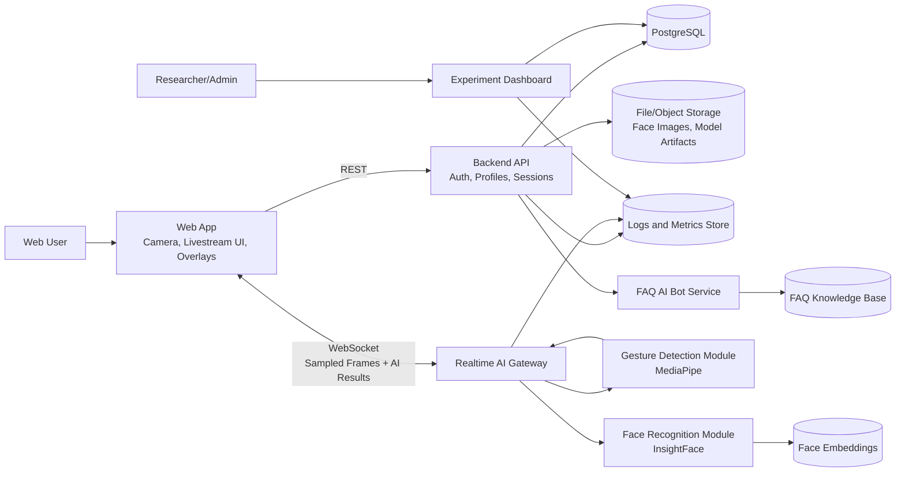
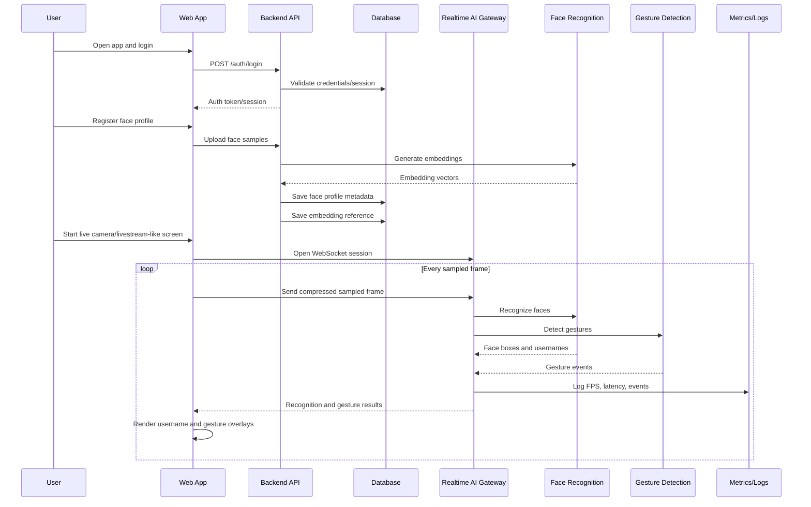
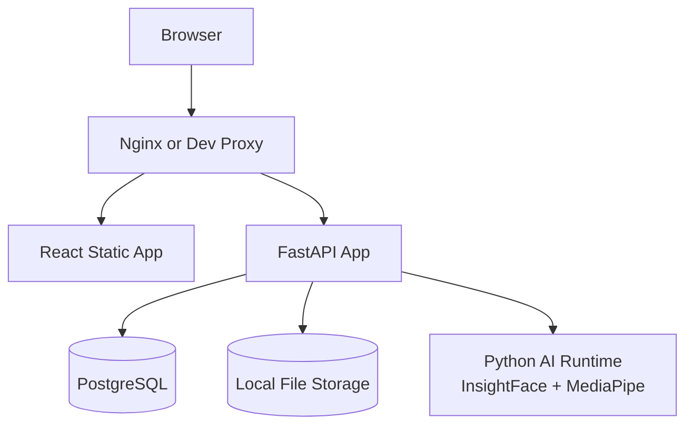
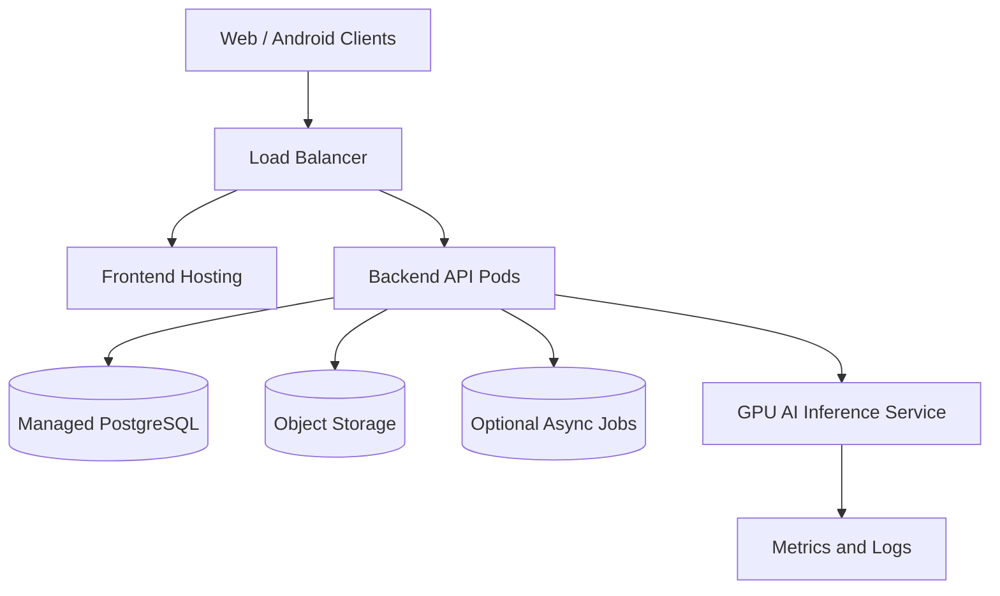

# Smart Livestream AI Platform Architecture v1

## 1. System Architecture Overview

This document proposes an evolution path from the current local Python PoC into a web-first Smart Livestream AI Platform. The goal is to keep the architecture feasible for an academic project while preserving a clear path toward future Android support and larger-scale deployment.

The recommended direction is a modular web application with a Python AI backend. The browser owns user interaction, camera preview, login screens, face profile registration flows, live camera/livestream-like display, and overlay rendering. The backend owns authentication, user/profile data, face embedding storage, AI inference orchestration, FAQ bot responses, logs, and experiment metrics.

The core AI research modules are Face Recognition and Gesture Recognition. The FAQ bot is a supporting user-assistance module, not the main research contribution.

For the MVP, realtime AI can be implemented with a single backend service using WebSocket communication between the browser and Python inference pipeline. The browser owns the camera preview and overlay rendering, while the backend WebSocket receives sampled and compressed frames for AI inference. The system should avoid sending every raw frame to the backend because that increases latency, bandwidth, and CPU load. Full livestream infrastructure similar to large-scale broadcast platforms is future scope.

As the project matures, the AI runtime can be separated into its own inference service. Android, Google/Facebook login, cloud scaling, GPU deployment, and multi-node livestream infrastructure should remain future scope.

## 2. Component Diagram

## 3. Data Flow Diagram

## 4. Main Modules and Services

### Web App

- Login and registration screens.
- Face profile registration UI.
- Camera and livestream-like preview.
- Username and gesture overlay rendering.
- FAQ support chat UI.
- Basic dashboard for personal profile and session history.

### Backend API

- User account management.
- Session/token validation.
- Face profile metadata management.
- Livestream session creation.
- Experiment and metrics query endpoints.
- FAQ bot request routing.

### Realtime AI Gateway

- WebSocket endpoint for sampled frame inference.
- Sampled/compressed frame validation.
- Calls face recognition and gesture detection modules.
- Returns structured AI results to the web client.
- Logs latency, FPS, recognition counts, and gesture events.

### Face Recognition Module

- Face detection.
- Embedding generation.
- Embedding comparison.
- Multi-face result formatting.
- Face profile registration support.

### Gesture Detection Module

- Hand landmark detection.
- Raise Hand detection.
- Wave detection.
- Gesture event smoothing/cooldown.

### FAQ AI Bot Service

- Supporting module for user help, not the core AI research contribution.
- Answers platform usage questions.
- Uses a curated FAQ knowledge base for MVP.
- Can later integrate a retrieval-based AI pipeline if needed.

### Logs and Metrics Module

- Runtime FPS.
- AI inference latency.
- Number of detected faces.
- Recognition confidence distribution.
- Gesture event counts.
- Error logs and session events.

## 5. Suggested Tech Stack

### MVP

- Frontend: React, TypeScript, Vite.
- UI: Tailwind CSS or Material UI.
- Backend: Python FastAPI.
- Realtime: FastAPI WebSocket.
- AI Runtime: InsightFace, MediaPipe, OpenCV, NumPy.
- Database: PostgreSQL.
- ORM: SQLAlchemy or SQLModel.
- Migrations: Alembic.
- Authentication: email/password with secure password hashing.
- Storage: local filesystem for academic MVP, with storage paths tracked in database. Face embeddings are biometric data and must be protected.
- Logs: Python logging plus structured JSON logs.
- Metrics: PostgreSQL tables or lightweight Prometheus-compatible metrics later.
- Testing: pytest for backend, Vitest/Playwright later for frontend.

### Future Scope

- Android: Kotlin or Flutter.
- Social login: Google/Facebook OAuth.
- Object storage: S3-compatible storage.
- Deployment: Docker, Nginx, cloud VM, managed PostgreSQL.
- GPU inference: CUDA-enabled inference node.
- Observability: Prometheus, Grafana, OpenTelemetry.

## 6. Database Tables

### users

| Column | Type | Notes |
| --- | --- | --- |
| id | UUID | Primary key |
| email | VARCHAR | Unique |
| username | VARCHAR | Display name |
| password_hash | VARCHAR | MVP email/password auth |
| role | VARCHAR | user/admin |
| created_at | TIMESTAMP | Creation time |
| updated_at | TIMESTAMP | Last update |

### face_profiles

| Column | Type | Notes |
| --- | --- | --- |
| id | UUID | Primary key |
| user_id | UUID | Foreign key to users |
| display_name | VARCHAR | Name shown in overlay |
| status | VARCHAR | active/disabled |
| created_at | TIMESTAMP | Creation time |
| updated_at | TIMESTAMP | Last update |

### face_embeddings

| Column | Type | Notes |
| --- | --- | --- |
| id | UUID | Primary key |
| face_profile_id | UUID | Foreign key to face_profiles |
| embedding_path | VARCHAR | File path or object storage key |
| embedding_dim | INTEGER | Embedding vector size |
| model_name | VARCHAR | Example: buffalo_l |
| sample_count | INTEGER | Number of registration samples |
| created_at | TIMESTAMP | Creation time |

### face_samples optional

Raw face images should not be stored by default. This table is optional and should be enabled only for controlled experiments with explicit consent, clear retention limits, and a deletion workflow. Production deployments should prefer storing embeddings and derived metadata instead of raw face samples unless there is a documented requirement.

| Column | Type | Notes |
| --- | --- | --- |
| id | UUID | Primary key |
| face_profile_id | UUID | Foreign key to face_profiles |
| image_path | VARCHAR | Stored image path/key |
| quality_score | FLOAT | Optional future quality score |
| created_at | TIMESTAMP | Creation time |

### livestream_sessions

| Column | Type | Notes |
| --- | --- | --- |
| id | UUID | Primary key |
| user_id | UUID | Session owner |
| status | VARCHAR | active/ended/error |
| started_at | TIMESTAMP | Start time |
| ended_at | TIMESTAMP | End time |
| avg_fps | FLOAT | Average displayed FPS |
| avg_latency_ms | FLOAT | Average AI response latency |

### recognition_events

| Column | Type | Notes |
| --- | --- | --- |
| id | UUID | Primary key |
| session_id | UUID | Foreign key to livestream_sessions |
| face_profile_id | UUID | Nullable for Unknown |
| label | VARCHAR | Username or Unknown |
| confidence | FLOAT | Recognition similarity |
| bbox_json | JSONB | Face bounding box |
| frame_index | INTEGER | Frame number |
| created_at | TIMESTAMP | Event time |

### gesture_events

| Column | Type | Notes |
| --- | --- | --- |
| id | UUID | Primary key |
| session_id | UUID | Foreign key to livestream_sessions |
| gesture_name | VARCHAR | Raise Hand or Wave |
| confidence | FLOAT | Gesture confidence |
| frame_index | INTEGER | Frame number |
| created_at | TIMESTAMP | Event time |

### faq_messages

| Column | Type | Notes |
| --- | --- | --- |
| id | UUID | Primary key |
| user_id | UUID | Foreign key to users |
| question | TEXT | User question |
| answer | TEXT | Bot answer |
| source | VARCHAR | faq/static/retrieval |
| created_at | TIMESTAMP | Message time |

### experiment_metrics

| Column | Type | Notes |
| --- | --- | --- |
| id | UUID | Primary key |
| session_id | UUID | Nullable session reference |
| metric_name | VARCHAR | fps, latency, cpu usage, etc. |
| metric_value | FLOAT | Numeric value |
| metadata_json | JSONB | Extra experiment context |
| created_at | TIMESTAMP | Metric time |

## 7. API Endpoint List

### Auth

- `POST /api/auth/register`
- `POST /api/auth/login`
- `POST /api/auth/logout`
- `GET /api/auth/me`

### Face Profiles

- `POST /api/face-profiles`
- `GET /api/face-profiles`
- `GET /api/face-profiles/{profile_id}`
- `DELETE /api/face-profiles/{profile_id}`
- `POST /api/face-profiles/{profile_id}/samples`
- `POST /api/face-profiles/{profile_id}/embeddings`

### Livestream

- `POST /api/livestream-sessions`
- `GET /api/livestream-sessions`
- `GET /api/livestream-sessions/{session_id}`
- `POST /api/livestream-sessions/{session_id}/end`
- `WS /ws/livestream-sessions/{session_id}/ai`

### FAQ Bot

- `POST /api/faq/messages`
- `GET /api/faq/messages`

### Metrics and Logs

- `GET /api/metrics/sessions/{session_id}`
- `GET /api/metrics/experiments`
- `GET /api/logs/sessions/{session_id}`

## 8. Deployment Architecture

### Academic MVP Deployment

For an academic MVP, a single machine deployment is acceptable. The frontend can be served as static files, FastAPI can run the API and WebSocket endpoints, PostgreSQL can run locally or on the same lab server, and AI inference can run in the same Python process.

### Future Deployment

Cloud scaling, queues, GPU inference nodes, object storage, and Android clients should be added only after the web MVP validates the core product workflow.

## 9. Risks and Mitigation

| Risk | Impact | Mitigation |
| --- | --- | --- |
| CPU inference is too slow for realtime web streaming | Poor UX | Use frame sampling, recognition caching, lower frame resolution, and optional GPU later |
| Network frame streaming adds latency | Overlay delay | Compress frames, send sampled frames only, keep overlays client-side |
| Face recognition false positives | User trust issue | Tune thresholds, collect diverse samples, show confidence during experiments |
| Gesture false positives | Incorrect effects | Add cooldowns, smoothing, and user testing |
| Biometric data privacy | High ethical and security risk | Treat face embeddings as biometric data, avoid raw face image storage by default, require consent, support deletion, and limit access |
| Scope creep | Project delay | Keep Android/social login/cloud scaling as future scope |
| FAQ bot hallucination | Bad support answers | Start with curated FAQ responses, add retrieval only after validation |
| Multi-user livestream complexity | Higher architecture burden | MVP should support one broadcaster session first |
| Browser camera compatibility | Device-specific issues | Test on Chrome/Edge first, document supported browsers |

## 10. MVP vs Future Scope

### MVP Scope

- Web app with email/password login.
- Face profile registration from browser camera.
- Live camera / livestream-like interaction screen.
- Realtime face recognition through backend WebSocket.
- Username overlay rendered in browser.
- Raise Hand and Wave gesture effects.
- Basic FAQ support bot with curated answers.
- Local or lab-server deployment.
- PostgreSQL-backed user, face profile, session, and metrics data.
- Logs and experiment metrics for FPS, latency, recognition, and gestures.

### Future Scope

- Android application.
- Google/Facebook login.
- Cloud deployment and auto-scaling.
- GPU inference service.
- Multi-broadcaster livestream infrastructure.
- Person-specific gesture attribution.
- Advanced gesture model.
- Full observability stack with dashboards.
- Object storage for production-scale media.
- Moderation and admin tools.
- Production-grade privacy, consent, and data retention workflows.
